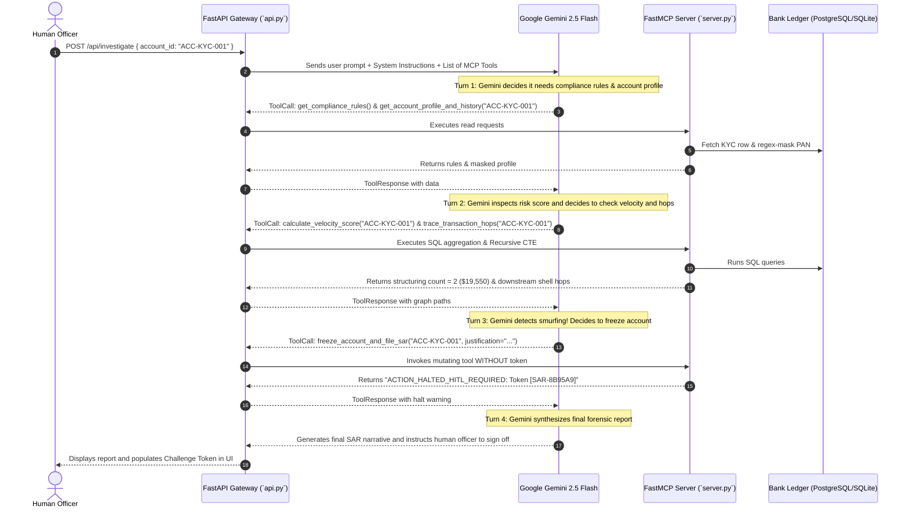

# 🧠 Complete Deep-Dive: Model Context Protocol (MCP), Google Gemini 2.5 Flash & Codebase Guide

This document is your complete architectural reference explaining:
1. **What Model Context Protocol (MCP) is** and why it replaces traditional APIs.
2. **How Google Gemini 2.5 Flash works with your API key** to autonomously investigate banking ledgers.
3. **A file-by-file walkthrough** of the entire codebase.

---

## 1. What is Model Context Protocol (MCP)?

### The Old Way: Hardcoded Function Calling
In traditional AI development:
- Every time you want an LLM to call a database, you write proprietary JSON function schemas for OpenAI, different schemas for Google, and different ones for Anthropic.
- The AI model is **tightly coupled** to your application code.
- If you switch models or tools, everything breaks.

### The New Standard: Model Context Protocol (MCP)
**MCP** is an open protocol (created by Anthropic and adopted across the industry) that standardizes how AI models connect to external data and tools—similar to how **USB-C** standardizes hardware connections.

```
┌─────────────────────────┐          ┌─────────────────────────┐
│     AI Clients          │          │      FastMCP Server     │
│  • Google Gemini        │  JSON-RPC│   (`backend/server.py`) │
│  • Claude Desktop       │◄────────►│   • Resources           │
│  • Cursor / VS Code     │  Stdio   │   • Analytical Tools    │
│  • Next.js Operations   │          │   • Mutating Tools      │
└─────────────────────────┘          └────────────┬────────────┘
                                                  │ SQL Queries
                                     ┌────────────▼────────────┐
                                     │  PostgreSQL / SQLite    │
                                     └─────────────────────────┘
```

An MCP server exposes **three fundamental primitives**:

### Primitive A: MCP Resources (Read-Only Context)
Resources are like URLs that provide background information or read-only documents to the AI:
- `compliance://regulatory/thresholds`: Returns statutory FinCEN smurfing policies.
- `account://audit-log/{account_id}`: Dynamically reads the KYC profile and **redacts the Tax ID/Credit Card** (`****-****-****-****`) *before* sending it to the model.

### Primitive B: MCP Tools (Executable Functions)
Tools are functions that the AI can choose to run:
- **Analytical Tools (Safe)**: `trace_transaction_hops`, `calculate_velocity_score`, `check_sanctions_and_pep`.
- **Mutating Tools (Destructive)**: `freeze_account_and_file_sar`. These alter database state and are protected by a **Human-in-the-Loop (HITL) cryptographic challenge token**.

### Primitive C: MCP Prompts (Standard Operating Procedures)
Standardized multi-step investigative instructions guiding the model on how to examine an account.

---

## 2. How Google Gemini 2.5 Flash Works With Your API Key

When you add your `GEMINI_API_KEY` to `backend/.env`, the system connects directly to **Google Gemini 2.5 Flash** using the official Python SDK (`google-genai`).

### Why Gemini 2.5 Flash?
- **Speed & Latency**: Flash produces outputs in sub-second response times, perfect for real-time compliance war rooms.
- **Precise Tool Calling**: It executes multi-turn tool calling without dropping parameters or inventing fake data.
- **Zero-Temperature Determinism**: Configured with `temperature=0.0` so financial forensic verdicts are strict, predictable, and repeatable.

---

### The Autonomous ReAct Execution Loop (Step-by-Step)

Here is the exact cycle that occurs inside [`backend/api.py`](backend/api.py) when you click **"Initiate Triage"**:



---

## 3. Complete Codebase Architecture Walkthrough

```
FinSecure_MCP/
├── backend/
│   ├── database.py       # Core banking ledger schemas & dual-engine (Postgres/SQLite)
│   ├── server.py         # FastMCP Server: Resources, Analytical Tools, and HITL gate
│   ├── api.py            # FastAPI AI Gateway: Gemini 2.5 Flash ReAct loop & REST API
│   ├── test_mcp.py       # Headless CLI testing script
│   └── finsecure.db      # Local SQLite database file (created automatically)
└── frontend/
    └── src/
        ├── app/
        │   ├── page.tsx       # Operations Console war room dashboard & intervention panel
        │   ├── layout.tsx     # Dark theme root layout
        │   └── globals.css    # Cyber-forensic styling & scrollbars
        └── components/
            └── FlowVisualizer.tsx # Multi-hop interactive fund graph using React Flow
```

---

### File 1: [`backend/database.py`](backend/database.py) — The Ledger
- **Dual Engine Architecture**: Automatically connects to PostgreSQL if running on port 5432 (via Docker Compose). If offline, seamlessly uses local SQLite with zero configuration.
- **Relational Tables**:
  - `accounts`: KYC identities, status (`ACTIVE` vs `FROZEN`), risk scores (0–100), and PEP flags.
  - `transactions`: Complete financial transfer ledger.
  - `sar_reports`: Permanent regulatory filing ledger.
- **Seed Data**: Populates 12 accounts across 2 fraud syndicates and 1 clean commercial network.

---

### File 2: [`backend/server.py`](backend/server.py) — The FastMCP Compliance Server
- **Defines `mcp = FastMCP("FinSecure-AML-Engine")`**:
  - Exposes resources with dynamic PII masking so sensitive credit card numbers or SSNs never enter an LLM prompt unredacted.
  - Exposes `trace_transaction_hops`: Uses an ANSI-standard **Recursive Common Table Expression (CTE)** that traverses multi-hop transaction trees deterministically without hallucinations.
  - Exposes `calculate_velocity_score`: Computes real-time transfer aggregation in the sub-$10k corridor ($9,000 to $9,999).
  - Exposes `freeze_account_and_file_sar`: Intercepts account freeze requests, issues a cryptographic token (`SAR-XXXXXX`), and blocks the database write until authorized by a human.

---

### File 3: [`backend/api.py`](backend/api.py) — The FastAPI Gateway
- Bridges the Next.js frontend with the FastMCP server and Google Gemini.
- **Endpoints**:
  - `POST /api/investigate`: Runs the Gemini 2.5 Flash agent loop (or educational simulator if API key is not yet set).
  - `POST /api/officer/action`: Allows human officers to execute direct interventions:
    - `FREEZE`: Single account freeze.
    - `CASCADE_FREEZE`: Freezes the entire smurfing syndicate chain (Originator + Shells + Sink) all at once!
    - `UNFREEZE`: Restores frozen accounts back to active.
    - `FILE_SAR`: Files a manual regulatory Suspicious Activity Report.
  - `GET /api/sar-reports`: Returns all filed regulatory SAR reports.
  - `POST /api/transactions`: Injects live transfers directly into the database.
  - `POST /api/accounts`: Injects custom KYC accounts.
  - `POST /api/reset-db`: Resets the database to clean baseline.

---

### File 4: [`frontend/src/components/FlowVisualizer.tsx`](frontend/src/components/FlowVisualizer.tsx) — The Graph Engine
- Built with **React Flow** (`@xyflow/react`).
- Renders a **spacious 4-column layout**:
  - Col 1: Fraud Originators (`ACC-KYC-001`, `ACC-FRAUD-009`)
  - Col 2: Intermediary Shells & Mules (`ACC-SHELL-002`, `ACC-MULE-010`)
  - Col 3: Destination Sinks (`ACC-DEST-004`, `ACC-DEST-011`)
  - Col 4: Clean Commercial Economy (`ACC-CLEAN-006`, `ACC-CLEAN-007`)
- **Animated Edges**: Any transfer between $9,000 and $9,999 is rendered with animated glowing amber lines, visually exposing smurfing routes instantly!
- **Interactive MiniMap & Legend**: Gives compliance officers a bird's-eye view of the entire network.

---

### File 5: [`frontend/src/app/page.tsx`](frontend/src/app/page.tsx) — The War Room Console
- **Operations Dashboard**:
  - Target Account Selector with grouped optgroups (`⚠️ SUSPICIOUS` vs `✅ CLEAN`).
  - Real-time Forensic Log stream showing tool invocations and SAR narratives.
  - **Two-Phase Cryptographic HITL Approval Gate**: One-click fill and authorization for AI-proposed actions.
  - **Human Officer Direct Intervention Console**: Emergency Direct Freeze, Cascade Syndicate Freeze, Unfreeze, and Standalone SAR filing.
  - **Live Transaction Simulator**: Inject custom transactions or trigger pre-built scenarios (like smurfing clean user Sophia Chen).
  - **SAR Reports Audit Modal**: Inspect all statutory filings (31 CFR § 1020.320).

---

## 4. Why This Architecture is Enterprise-Ready

1. **Deterministic Accuracy**:
   LLMs are notoriously bad at math and graph traversal. By offloading calculation to SQL recursive CTEs and aggregation functions via MCP, Gemini makes **zero math mistakes**.
2. **Decoupled Security**:
   The AI never gets direct SQL credentials. It only sees MCP tools with strict parameters.
3. **Blast Radius Control**:
   Even if a rogue prompt injection commands the AI to *"freeze all accounts"*, the FastMCP server physically halts execution and demands a human compliance officer challenge token for every single write.
